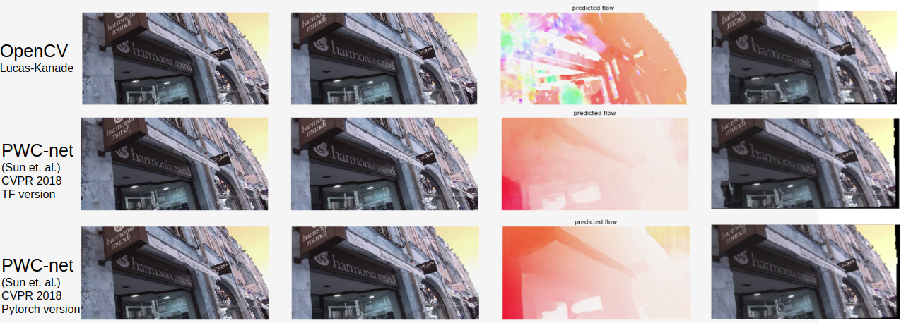
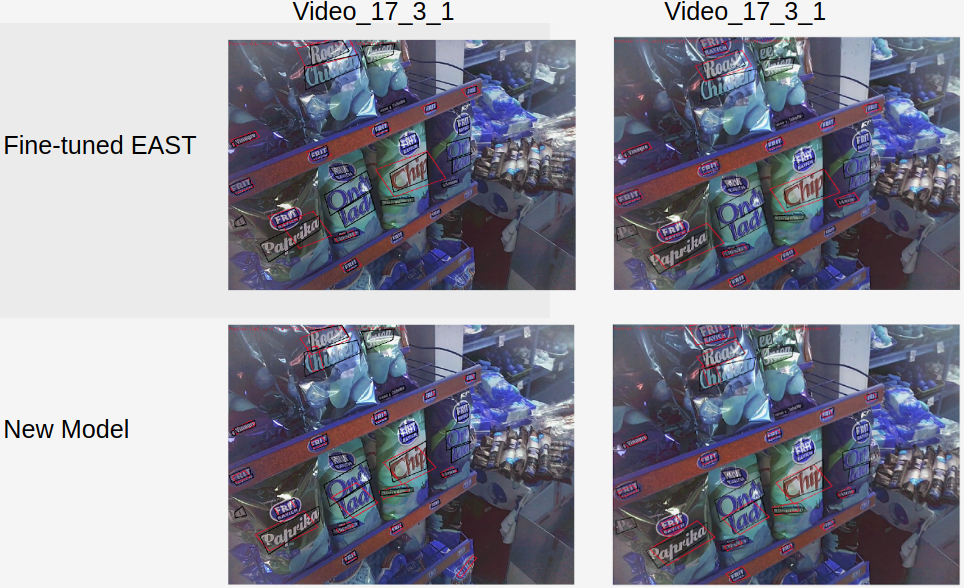
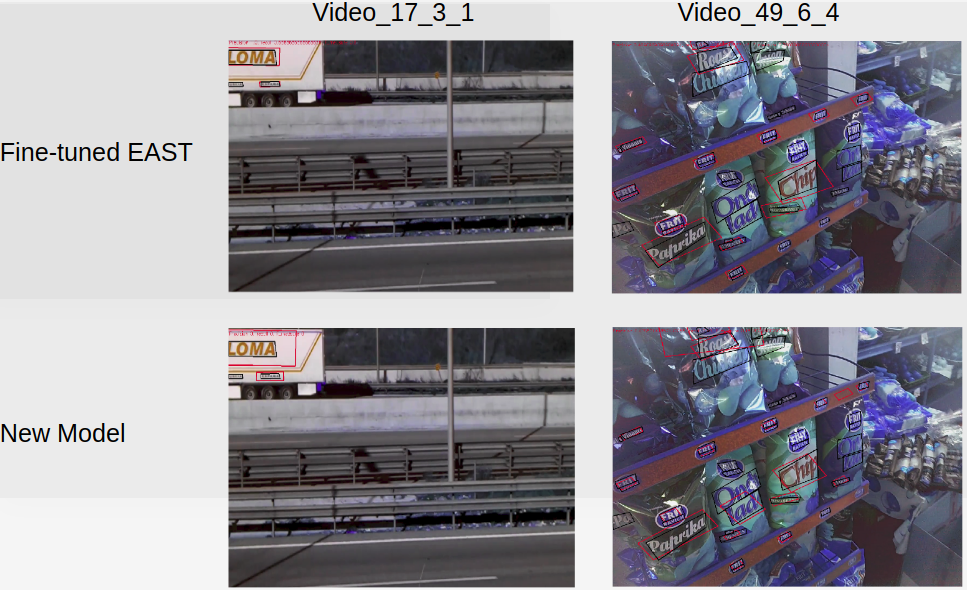
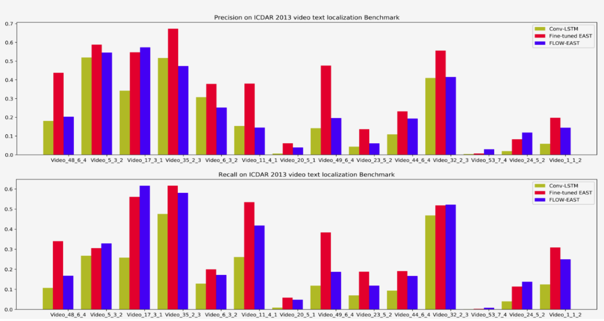

### 1. Introduction & Problem statement 
As an important and challenging problem in computer vision, scene text detection has been drawing researchers' interest. The performance of text detection are largely pushed forward along with the boom of deep learning.
However, although people have proposed different models to improve text detection in single image, less attention is paid to improve text detection in video, which is more challenging due to effects like motion blur, extreme rotation of text lines. 

Given a video as input, we want to build a new model based on existing single image text detector, and improve the performance regarding accuracy, while not bring to much overhead to system efficiency. 

### 2. Flow Estimation  Test

<caption>
 <u>  **Figure 1** </u>  : **Flow Estimation**  From left to right are: image1, image2, dense flow map, warpped image1. Warpped image1 should be close to image2
</caption>

### 3. Results Analysis on ICDAR 2013 Benchmark

<caption>
 <u>  **Figure 2** </u>  : **Good Examples** 
 Boxes that have challenging rotation angle, or small size, could be detected by the new model, while original EAST couldn't detect them very well, also the detected boxes geometry are more precise.</caption>

<caption>
 <u>  **Figure 3** </u>  : **Failure Cases**  
For boxes sitting near the boundary, feature aggregation would sometimes fail due to imprecise flow esimation; robust flow estimation guarantees the precision for boxes prediction.</caption>

### 4. Preliminary Test on ICDAR 2013 Benchmark

<caption>
 <u>  **Figure 4** </u>  : **Results Comparison**  
</caption>

### 5. Conclusion

From the preliminary test results, we could see the detection performance for some videos are boosting up when we apply flow-based feature aggregation to a single image text detector, the recall has significant improvement; However, the dense feture aggregation is not robust to all videos, especially for regions that flow estimation is not accurate. Further ways to improve flow estimation or reduce the dependency on flow need to be proposed. 
